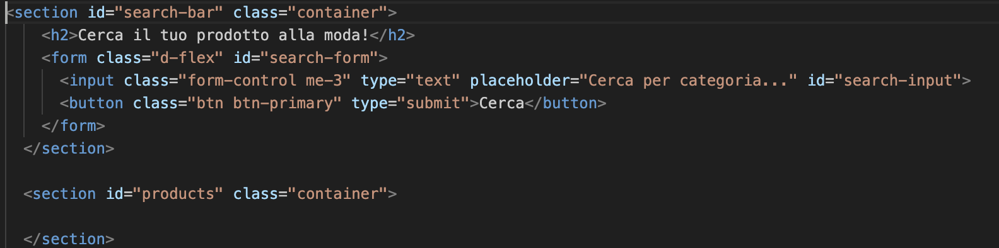

# PROGETTO ESAME
**Web Design 2 - Matteo Baccan**
## E-commerce di Borse&Calzature

**Federica Ferrenti**

3° anno Graphic Design and Art Direction

A.A 2022/2023 - ACME NOVARA

--- 

# e-commerce- Be Fashion

 Durante il corso di Web Design 2 abbiamo creato un e-commerce con più pagine ed elementi interattivi

il nome del sito web che ho realizzato è BE FASHION, UN E-COMMERCE DI ACCESSORI (Borse&scarpe)

---
# STRUMENTI

Gli strumenti per la programmazione del sito sono stati sono HTML, CSS e Javascript.

ho lavorato su Visual studio code e github, successivamente ho pubblicato il repository su netlify a questo indirizzo https://ferrentiprogettoe-commerce.netlify.app/

---
# SUPPORTI

Visual studio code è visual studio code, github e netlify

---
#  Visual Studio Code

Visual studio code è con github e net

---

# Chat Gpt AI
Chat gpt mi ha aiutato nella realizzazione di testi e in parte di codici

"mi scrivi una descrizione per una borsa di media grandezza  con più reparti interni con catena dorata e chiusura a bottone"

ChatGPT
Descrizione della borsa di media grandezza con più reparti interni, catena dorata e chiusura a bottone:

"La nostra borsa di media grandezza con più reparti interni è un'opzione perfetta per coloro che cercano un equilibrio ideale tra stile e funzionalità. Questo elegante accessorio è progettato per adattarsi alle esigenze della vita quotidiana, offrendo spazio sufficiente per organizzare i tuoi oggetti personali in modo ordinato e mantenere tutto a portata di mano."

---

# Boostraph
Bootstrap è una raccolta di strumenti liberi per lacreazione di siti e applicazioni per il Web. Contienemodelli di progettazione basati su HTML e CSS, eper le varie componenti dell'interfaccia, comemoduli, pulsanti e navigazione.
Divide lo spazio in terzi : 12 colonne. Quando lospazio è small, deve occupare 12 colonne, quandoè medio 4, quando è
grande, 4.
Ci consente direndere una pagina responsive

---
# JQuery
Cos'è jQuery e a cosa serve
jQuery è una libreria JavaScript cross-browser rilasciata nel 2006. Veloce, versatile ed estensibile, l'API di jQuery consente di gestire con semplicità delle attività che risulterebbero lunghe o complesse in JavaScript.  

---

# LA CREAZIONE DEL SITO WEB

---

# STRUTTURA

Il sito è composto da 5 pagine: 
Home, Chi siamo, Borse, Scarpe, Carrello, Contatti

Tutte le pagine sono dootate di una struttura base : nav bar con logo e footer.

---

# Home

nella home è presente una nav bar che permette all'utente di andare alla pagina desiderata, come in tutte le pagine.

nella parte sottostante è presente una barra di ricerca che indirizza direttamente alla pagina delle scarpe o delle borse tramite un link

All'interno dello home ho inserito un carosello che mostra le due principali categorie di prodotti che il mio e-commerce vende: borse e scarpe. 

---

# Cookie

All'interno dello home ho inserito un pop up con cookie che indirizza alla pagina della privacy

---
# Codice

html

---
# Carosello

All'interno dello home ho inserito un carosello che mostra le due principali categorie di prodotti che il mio e-commerce vende: borse e scarpe.

---
# codice
html 

---
# codice
js

---

# Barra di ricerca

---

# Codice

html

---

# Codice

html
js

---
# CHI SIAMO
nella pagina del chi siamo ho inserito una descrizione del brand e una presentazione di quello che i clienti vedranno nell' e-commerce

---

# BORSE
all'interno della pagina dei prodotti, ho inserito tre tipologie di borse diverse. Cliccando su "visualizza" l'utente verrà indirizzato alla pagina del prodotto in dettaglio.

---
# Pagina dettaglio prodotto
in questa pagina l'utente potrà visualizzare il prodotto scelto accompagnati da una descrizione più approfondita e una possibilità di cambio colore.

<<<<<<< HEAD

--- 

# cambio colore html

---
# cambio colore js

---
# SCARPE
all'interno della pagina dei prodotti, ho inserito tre tipologie di scarpe diverse. Cliccando su "visualizza" l'utente verrà indirizzato alla pagina del prodotto in dettaglio.

---
# pagina dettaglio prodotto
in questa pagina l'utente potrà visualizzare il prodotto scelto accompagnati da una descrizione più approfondita e una possibilità di cambio taglia.

---

# Cambio taglia html

---

# Cambio taglia js

---
# CARRELLO
Nella pagina del carrello ho inserito tre prodotti di esempio con il relativo prezzo. grazie all'utlizzo di jquery verrà effettuato il calcolo totale automatico del prezzo totale. Ho aggiunto inoltre la possibilità di rimuovere il prodtto dalla lista.

---
# Calcolo totale - jquery

---
# Rimozione prodotto - html

---
# CONTATTI
Nella pagina dei contatti ho inserito le informazioni per contattare il negozio: posizione, telefono, mail.

---
# Modulo invio domanda
all'interno della pagina contatti ho anche inserito un modulo che permette all'utente di scrivere un messaggio per chiedere ulteriori informazioni.

---
# Modulo invio domanda

---

# Privacy

Ho inserito inoltre il consenso per la privacy da accettare prima di inviare il messaggio con collegatmento alla pgina dedicata alinformativa sulla privacy.

---

# Mappa

Ho inserito la mappa presa da googleMaps

---

# QRCODE

---

# RESPONSIVE

screen

---

# RESPONSIVE

screen

---
# VALIDATOR
screen

---
# PAGESPEED Insight
è uno strumento gratuito diGoogle che permette di misurare la velocità dicaricamento di una pagina web.

---
# WC3 Validator
W3C Validator
è un validatore del WorldWide Web Consortium che consente agliutenti di Internet di controllare idocumenti HTML e XHTML;
è un passoimportante verso la garanzia della qualitàtecnica delle pagine web.

---
