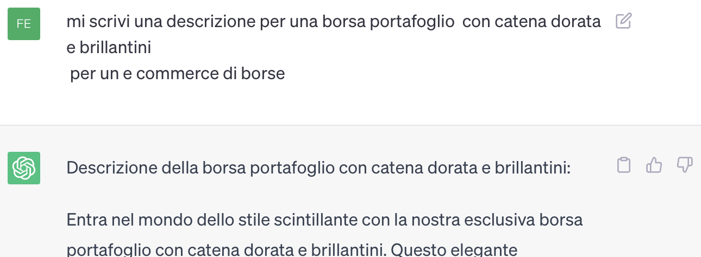
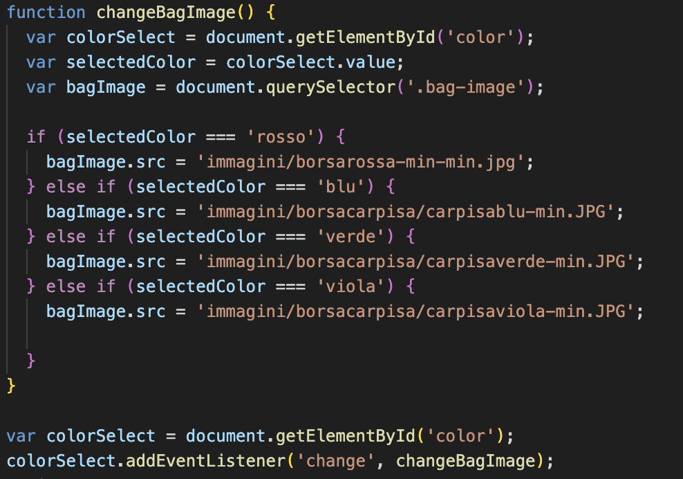

---

# PROGETTO ESAME
**Web Design 2 - Matteo Baccan**
## E-commerce di Borse&Calzature

**Federica Ferrenti**

3° anno Graphic Design and Art Direction

A.A 2022/2023 - ACME NOVARA

--- 

# e-commerce- Be Fashion

 Durante il corso di Web Design 2 abbiamo creato un e-commerce con più pagine ed elementi interattivi

il nome del sito web che ho realizzato è BE FASHION, UN E-COMMERCE DI ACCESSORI (Borse&scarpe)

---
STRUMENTI

Gli strumenti per la programmazione del sito sono stati sono HTML, CSS e Javascript.

ho lavorato su Visual studio code e github, successivamente ho pubblicato il repository su netlify a questo indirizzo https://ferrentiprogettoe-commerce.netlify.app/

---
# SUPPORTI

Visual studio code è visual studio code, github e netlify

---
##  VISUAL STUDIO CODE

Visual studio code è con github e net

---

# CHAT GPT AI

Chat gpt mi ha aiutato nella realizzazione di testi e in parte di codici

---

# boostraph

---
# JQuery

---

# LA CREAZIONE DEL SITO WEB

---

# STRUTTURA

Il sito è composto da 5 pagine: 
Home, Chi siamo, Borse, Scarpe, Carrello, Contatti

Tutte le pagine sono dootate di una struttura base : nav bar con logo e footer.

---

## HOME

nella home è presente una nav bar che permette all'utente di andare alla pagina desiderata, come in tutte le pagine.

nella parte sottostante è presente una barra di ricerca che indirizza direttamente alla pagina delle scarpe o delle borse tramite un link

All'interno dello home ho inserito un carosello che mostra le due principali categorie di prodotti che il mio e-commerce vende: borse e scarpe.

---

# cookie

All'interno dello home ho inserito un pop up con cookie che indirizza alla pagina della privacy

---
# codice

html

js

---
# carosello

All'interno dello home ho inserito un carosello che mostra le due principali categorie di prodotti che il mio e-commerce vende: borse e scarpe.

html 

---
# codice

html

js

---

# barra di ricerca

---

# codice

html

js

---
## JQUERY

Cos'è jQuery e a cosa serve
jQuery è una libreria JavaScript cross-browser rilasciata nel 2006. Veloce, versatile ed estensibile, l'API di jQuery consente di gestire con semplicità delle attività che risulterebbero lunghe o complesse in JavaScript.  

---

# presentazione

---
## CHI SIAMO
nella pagina del chi siamo ho inserito una descrizione del brand e una presentazione di quello che i clienti vedranno nell' e-commerce

---

## BORSE
all'interno della pagina dei prodotti, ho inserito tre tipologie di borse diverse. Cliccando su "visualizza" l'utente verrà indirizzato alla pagina del prodotto in dettaglio.

---
# PAGINA DETTAGLIO PRODOTTO
in questa pagina l'utente potrà visualizzare il prodotto scelto accompagnati da una descrizione più approfondita e una possibilità di cambio colore.

---

# CAMBIO COLORE html

---
# CAMBIO COLORE js

---
## SCARPE
all'interno della pagina dei prodotti, ho inserito tre tipologie di scarpe diverse. Cliccando su "visualizza" l'utente verrà indirizzato alla pagina del prodotto in dettaglio.

---
# PAGINA DETTAGLIO PRODOTTO
in questa pagina l'utente potrà visualizzare il prodotto scelto accompagnati da una descrizione più approfondita e una possibilità di cambio taglia.

---

# CAMBIO TAGLIA html

---
# CAMBIO TAGLIA js

---
## CARRELLO
Nella pagina del carrello ho inserito tre prodotti di esempio con il relativo prezzo. grazie all'utlizzo di jquery verrà effettuato il calcolo totale automatico del prezzo totale. Ho aggiunto inoltre la possibilità di rimuovere il prodtto dalla lista.

---
# calcolo totale - jquery

---
# rimozione prodotto - html

---
## CONTATTI
Nella pagina dei contatti ho inserito le informazioni per contattare il negozio: posizione, telefono, mail.

---
# MODULO INVIO DOMANDA
all'interno della pagina contatti ho anche inserito un modulo che permette all'utente di scrivere un messaggio per chiedere ulteriori informazioni.

---
# MODULO INVIO DOMANDA

---

# privacy
Ho inserito inoltre il consenso per la privacy da accettare prima di inviare il messaggio con collegatmento alla pgina dedicata alinformativa sulla privacy.

---

# MAPPA
Ho inserito la mappa presa da googleMaps

---
## PRIVACY
screen

---

## RESPONSIVE
screen

---
## VALIDATOR
screen

---
# PAGESPEED Insight
screen

---
# WC3 Validator
screen

---