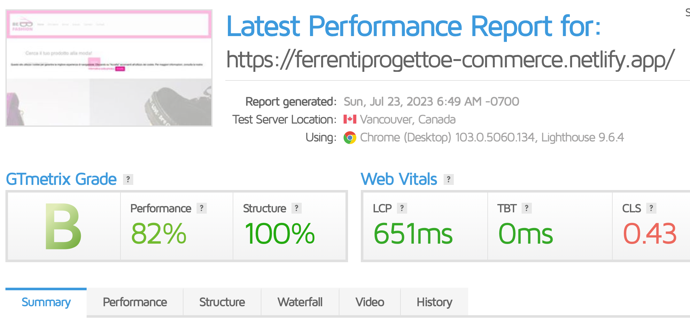

# PROGETTO ESAME
**Web Design 2 - Matteo Baccan**
## E-commerce di Borse&Calzature

**Federica Ferrenti**

3° anno Graphic Design and Art Direction

A.A 2022/2023 - ACME NOVARA


--- 

# e-commerce- Be Fashion

 Durante il corso di Web Design 2 ho creato un e-commerce con più pagine ed elementi interattivi.

Il nome del sito web è BE FASHION, un e-commerce ACCESSORI (Borse&scarpe)

---
# STRUMENTI

I file per la programmazione del sito sono stati sono HTML, CSS e Javascript.

Ho lavorato su Visual studio code e github, successivamente ho pubblicato il repository su netlify a questo indirizzo https://ferrentiprogettoe-commerce.netlify.app/

---
# SUPPORTI

I supporti utlizzati per il completamento del sito sono: Visual Studio Code, Github e Netlify.


---
#  Visual Studio Code

Visual Studio Code è un editor di codice sorgente sviluppato da Microsoft per Windows, Linux e macOS.


---

# Chat Gpt AI

Chat gpt mi ha aiutato nella realizzazione di testi e in parte di codici.

 Utente
Mi scrivi una descrizione per una borsa di media grandezza  con più reparti interni con catena dorata e chiusura a bottone"

 ChatGPT
Descrizione della borsa di media grandezza con più reparti interni, catena dorata e chiusura a bottone:
"La nostra borsa di media grandezza con più reparti interni è un'opzione perfetta per coloro che cercano un equilibrio ideale tra stile e funzionalità..."


---

# Boostraph

Bootstrap è una raccolta di strumenti liberi per lacreazione di siti e applicazioni per il Web. Contiene modelli di progettazione basati su HTML e CSS, eper le varie componenti dell'interfaccia, comemoduli, pulsanti e navigazione.


---
# JQuery


jQuery è una libreria JavaScript cross-browser rilasciata nel 2006. Veloce, versatile ed estensibile, l'API di jQuery consente di gestire con semplicità delle attività che risulterebbero lunghe o complesse in JavaScript.  


---

# LA CREAZIONE DEL SITO WEB


---

# STRUTTURA

Il sito è composto da 5 pagine: 
Home, Chi siamo, Borse, Scarpe, Carrello, Contatti.

Tutte le pagine sono dotate di elementi comuni: nav bar con logo, footer e elementi grafici.

---

# Home

Nella home è presente una nav bar che permette all'utente di raggiungere la pagina desiderata.

Nella parte sottostante ho inserito una barra di ricerca che indirizza direttamente alla pagina delle scarpe o delle borse tramite un link.


---
# Barra di ricerca

La barra di ricerca inserita effettua una ricerca e genera un link collegato alla pagina delle scarpe o delle borse a seconda del contenuto digitato.


---

 

---

```js
$(document).ready(function() {
  $('#search-form').on('submit', function(event) {
    event.preventDefault();

    var searchTerm = $('#search-input').val();

    // Esegui la ricerca e visualizza i risultati
    searchProducts(searchTerm);
  });
});

```
il codice utilizza jQuery per catturare l'evento di sottoposizione del modulo di ricerca, impedisce il ricaricamento della pagina, ottiene il termine di ricerca inserito dall'utente e lo passa a una funzione chiamata searchProducts() per eseguire la ricerca e visualizzare i risultati.


---

# Cookie

All'interno dello home ho inserito un pop up con cookie che indirizza alla pagina della privacy.


---

```js
function accettaCookie() {
  document.getElementById("cookie-popup").style.display = "none";
}
```
Quando l'utente clicca sul pulsante "Accetta", questa funzione viene chiamata. La sua unica istruzione è quella di nascondere il div dell'avviso dei cookie impostando la proprietà display su "none". In altre parole, l'avviso scompare dalla vista dell'utente quando il pulsante "Accetta" viene cliccato.

---

# Carosello

All'interno dello home ho inserito un carosello che mostra le due principali categorie di prodotti che il mio e-commerce vende: borse e scarpe.


---

```html
<div id="carouselExampleIndicators" class="carousel slide" data-bs-ride="carousel" data-bs-interval="1000">
  <ol class="carousel-indicators">
    <li data-bs-target="#carouselExampleIndicators" data-bs-slide-to="0" class="active"></li>
    <li data-bs-target="#carouselExampleIndicators" data-bs-slide-to="1"></li>...

```
Questo codice crea un carousel di immagini che scorre automaticamente ogni secondo (intervallo impostato a 1000 millisecondi) e offre anche la possibilità di controllare manualmente lo scorrimento utilizzando i link "Previous" e "Next".

---


# CHI SIAMO

nella pagina del chi siamo ho inserito una descrizione del brand e una presentazione di quello che i clienti vedranno nell' e-commerce.


---

# BORSE

all'interno della pagina dei prodotti, ho inserito tre tipologie di borse diverse. Cliccando su "visualizza" l'utente verrà indirizzato alla pagina del prodotto in dettaglio.


---
# Pagina dettaglio prodotto

in questa pagina l'utente potrà visualizzare il prodotto scelto accompagnati da una descrizione più approfondita e una possibilità di cambio colore.


---


---


# Cambio colore 

```js
 function changeBagImage() {
        var colorSelect = document.getElementById('color');
        var selectedColor = colorSelect.value;
        var bagImage = document.querySelector('.bag-image');

        if (selectedColor === 'rosso') {
          bagImage.src = 'immagini/borsarossa-min-min.jpg';
      ...
      }
      var colorSelect = document.getElementById('color');
      colorSelect.addEventListener('change', changeBagImage);
```
la funzione "changeBagImage" viene eseguita quando l'utente cambia l'opzione nel menu a discesa "color". Essa ottiene il colore selezionato e cambia l'immagine della borsa corrispondente. L'evento "change" al menu a discesa assicura che la funzione venga chiamata ogni volta che l'utente seleziona un colore differente.


---

# SCARPE

all'interno della pagina dei prodotti, ho inserito tre tipologie di scarpe diverse. Cliccando su "visualizza" l'utente verrà indirizzato alla pagina del prodotto in dettaglio.


---

# Pagina dettaglio prodotto

In questa pagina l'utente potrà visualizzare il prodotto scelto accompagnati da una descrizione più approfondita e una possibilità di cambio taglia.


---

# Visualizza taglia 

```js
function visualizzaTaglie() {
  var taglie = document.getElementById("taglie");
  var taglieup = document.getElementById("taglieup");
  var tagliedown = document.getElementById("tagliedown");
  if (taglie.style.display === "none") {
    taglie.style.display = "block";
    taglieup.style.display = "block";
    tagliedown.style.display = "none";
  } else {
    taglie.style.display = "none";
    taglieup.style.display = "none";
    tagliedown.style.display = "block";
  }
}
```

 la funzione visualizzaTaglie() consente di mostrare o nascondere le taglie disponibili e gestisce gli stili degli elementi correlati (come le frecce di navigazione) di conseguenza.

---

# Cambia taglia 

```js
function cambiaTaglia() {
  var taglia = document.getElementById("taglia");
  taglia.value = event.target.innerHTML;
}
```

La funzione cambiaTaglia() viene utilizzata per impostare il valore del campo di input di selezione della taglia in base all'opzione selezionata dall'utente.


---

# CARRELLO

Nella pagina del carrello ho inserito tre prodotti di esempio con il relativo prezzo. Grazie all'utlizzo di jquery verrà effettuato il calcolo totale automatico del prezzo complessivo. Ho aggiunto inoltre la possibilità di rimuovere il prodotto dalla lista.


---

# Calcolo totale - jquery

```js
$(document).ready(function() {
        $('.quantita').on('input', function() {
          calcolaTotale();
        });
  
        function calcolaTotale() {
          var totale = 0;
  
          $('.quantita').each(function() {
            var quantita = parseInt($(this).val());
            var prezzo = parseInt($(this).closest('tr').find('td:nth-child(3)').text().replace('€', ''));
            totale += quantita * prezzo;
          });
  
          $('#totale').text('€' + totale);
        }
      });
```

La funzione calcolaTotale() calcola il totale dei prodotti moltiplicando la quantità di ciascun prodotto per il suo prezzo unitario. Dopodiché, somma i risultati e imposta il testo di un elemento specifico con l'id "totale" con il valore calcolato, mostrando così il totale aggiornato del carrello.

---

# Rimozione prodotto - jquery

```js
 $(document).on('click', '.rimuovi-prodotto', function() {
          $(this).closest('tr').remove();
          calcolaTotale();
        });
```

 Questa funzione gestisce l'evento di click su un elemento con la classe "rimuovi-prodotto" e rimuove la riga del prodotto corrispondente dalla tabella del carrello. Poi, viene chiamata la funzione calcolaTotale() per aggiornare il totale dei prodotti nel carrello dopo la rimozione.


---

# CONTATTI

Nella pagina dei contatti ho inserito le informazioni per contattare il negozio: posizione, telefono, mail.


---

# Modulo invio domanda

All'interno della pagina "contatti" ho anche inserito un modulo che permette all'utente di scrivere un messaggio per chiedere ulteriori informazioni.


---

# Modulo invio domanda

```js
function inviaMessaggio() {
      var consensoCheckbox = document.getElementById("checkboxConsenso");
      if (!consensoCheckbox.checked) {
        alert("Devi accettare l'informativa sulla privacy per inviare il messaggio.");
        return false;
      }
      // Resto del codice per l'invio del messaggio
      // ...
      // Se l'invio è completato con successo, mostrare il messaggio di ringraziamento
      document.getElementById("consenso").style.display = "none";
      document.getElementById("messaggio").style.display = "block";
      return false;
    }
 ```
Questa funzione gestisce l'invio di un messaggio da un modulo, ma solo se l'utente ha fornito il consenso all'utilizzo dei dati personali, altrimenti mostrerà un avviso. Dopo l'invio del messaggio, viene visualizzato un messaggio di ringraziamento al posto dell'avviso di consenso.

---

# Consenso privacy

Ho inserito inoltre il consenso per la privacy da accettare prima di inviare il messaggio con collegamento alla pagina dedicata alinformativa sulla privacy.


---

```js
function accettaInformativa() {
  var checkbox = document.getElementById('checkboxConsenso');
  var messaggio = document.getElementById('messaggio');

  if (checkbox.checked) {
    messaggio.style.display = 'block';
  } else {
    messaggio.style.display = 'none';
  }
}
```

Questa funzione viene chiamata quando l'utente spunta o deseleziona la casella di controllo per accettare l'informativa sulla privacy. Se la casella è spuntata, mostra il messaggio o l'avviso. Se la casella non è spuntata, nasconde il messaggio. La funzione gestisce quindi la visualizzazione del messaggio in base allo stato della casella di controllo.

---

# PRIVACY

All'interno della pagina della privacy, presente all'interno dei siti web, sono presenti informazioni riguardo i tipi di trattamento, le finalità per cui i dati vengono utilizzati, le misure prese per proteggere le informazioni e i diritti degli utenti riguardo l'uso dei loro dati.


--- 

# RESPONSIVE


---

# GtMetrix

GtMetrix è uno dei migliori strumenti per testare la velocità e le prestazioni di un sito web.




---

# Grazie per l'attenzione
  Federica Ferrenti
